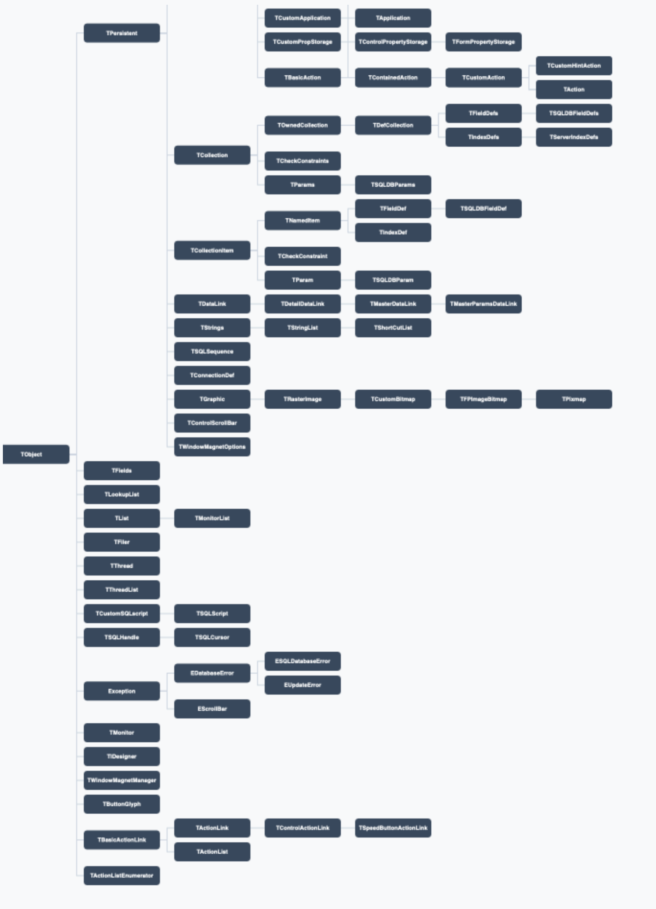
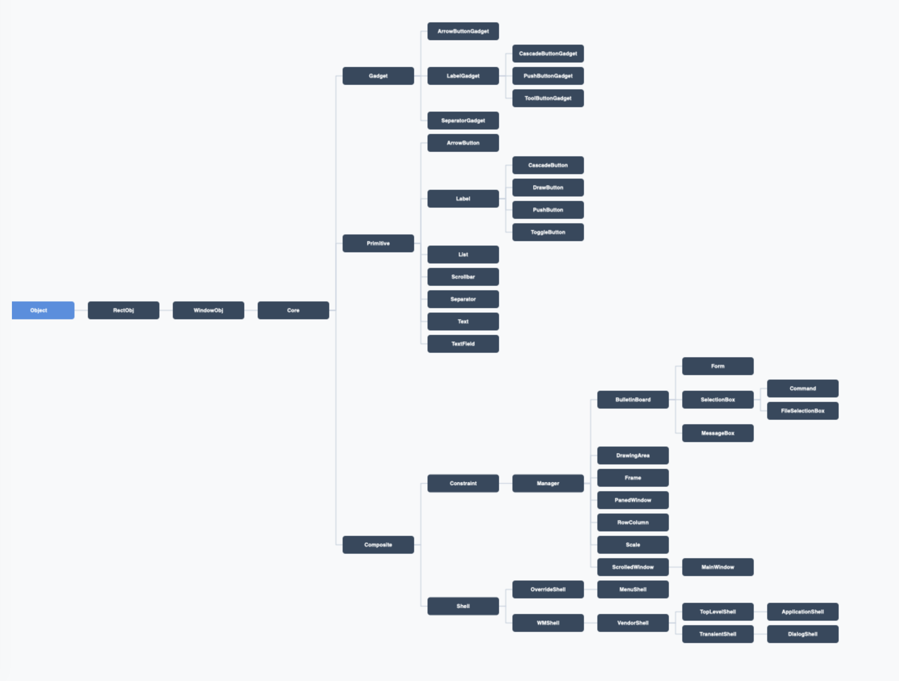
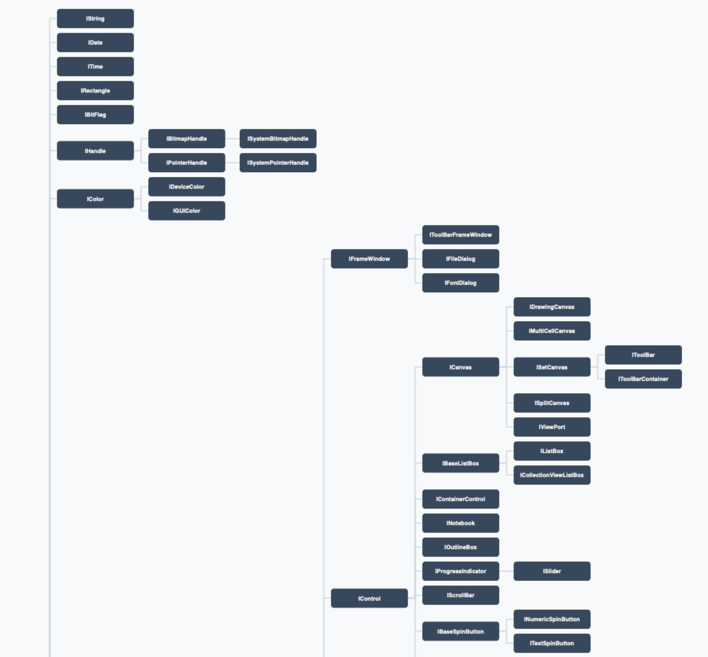

# javascript-canvas-class-diagram
Fun project in pure javascript that creates a diagram

Delphi VCL Hierarchy (Partial)

Motif 2.3+ Widget Hierarchy

ViewKit/ViewKlass Class Hierarchy

IBM Open Class Hierarchy (UI part)

